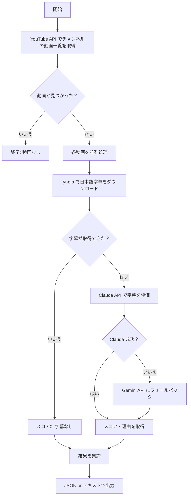

# YouTube Checker 手動実行手順書

YouTube チャンネルの動画を巡回し、字幕をAIで解析して視聴推薦スコアを出すシステムの手動実行ガイドです。

---

## 1. 前提条件

### 必要なソフトウェア

| ソフトウェア | バージョン | 確認コマンド |
|---|---|---|
| Python | 3.10 以上 | `python --version` |
| pip | 最新推奨 | `pip --version` |
| yt-dlp | 2024.0.0 以上 | `yt-dlp --version` |

### 必要な API キー

| キー | 取得先 | 用途 |
|---|---|---|
| `YOUTUBE_API_KEY` | [Google Cloud Console](https://console.cloud.google.com/) | YouTube Data API v3（動画リスト取得） |
| `CLAUDE_API_KEY` | [Anthropic Console](https://console.anthropic.com/) | 字幕の AI 評価（メイン） |
| `GEMINI_API_KEY` | [Google AI Studio](https://aistudio.google.com/) | 字幕の AI 評価（フォールバック） |

> [!IMPORTANT]
> YouTube Data API v3 は Google Cloud Console で **API を有効化** し、**API キーを発行** する必要があります。

---

## 2. 環境セットアップ

### 2-1. プロジェクトディレクトリへ移動

```powershell
cd C:\Users\fish_\ドキュメント\claudecode\python\youtube_checker
```

### 2-2. 仮想環境の作成（初回のみ）

```powershell
python -m venv venv
```

### 2-3. 仮想環境の有効化

```powershell
.\venv\Scripts\Activate.ps1
```

> [!TIP]
> プロンプトの先頭に `(venv)` と表示されれば有効化成功です。

### 2-4. 依存パッケージのインストール（初回 or 更新時）

```powershell
pip install -r requirements.txt
```

### 2-5. 環境変数ファイルの設定（初回のみ）

`.env.example` をコピーして `.env` を作成し、API キーを設定します。

```powershell
# まだ .env がない場合
Copy-Item .env.example .env
```

`.env` を編集して、実際の API キーを設定します：

```ini
# YouTube Data API v3
YOUTUBE_API_KEY=your_youtube_api_key_here

# Claude API
CLAUDE_API_KEY=your_claude_api_key_here

# Gemini API
GEMINI_API_KEY=your_gemini_api_key_here

# オプション設定
CHECK_DAYS=3
MAX_CONCURRENT_TASKS=5
```

---

## 3. 実行方法

### 3-1. 基本コマンド

```powershell
python main.py --channel <チャンネルID>
```

> [!NOTE]
> チャンネル ID は `UCxxxx` 形式の文字列です。YouTube チャンネルページの URL から確認できます。
> 例: `https://www.youtube.com/channel/UCxxxxxxxxxxxxxxxxxxxxxx`

### 3-2. コマンドライン引数一覧

| 引数 | 必須 | デフォルト | 説明 |
|---|---|---|---|
| `--channel` | ✅ | — | YouTube チャンネル ID（`UCxxxx` 形式） |
| `--channel-name` | — | `""` | チャンネル名（出力に表示、省略可） |
| `--days` | — | `3` | 取得する期間（直近 N 日） |
| `--output` | — | `json` | 出力形式（`json` または `text`） |

### 3-3. 実行例

#### JSON 出力（デフォルト）

```powershell
python main.py --channel UCxxxxxxxxxxxxxxxxxxxxxxxx
```

#### テキスト出力 + チャンネル名指定

```powershell
python main.py --channel UCxxxxxxxxxxxxxxxxxxxxxxxx --channel-name "チャンネル名" --output text
```

#### 取得期間を7日間に変更

```powershell
python main.py --channel UCxxxxxxxxxxxxxxxxxxxxxxxx --days 7
```

#### すべてのオプションを使用

```powershell
python main.py --channel UCxxxxxxxxxxxxxxxxxxxxxxxx --channel-name "サンプルチャンネル" --days 7 --output text
```

---

## 4. 出力形式

### JSON 出力（`--output json`）

```json
{
  "channel_name": "チャンネル名",
  "channel_id": "UCxxxxxxxx",
  "videos": [
    {
      "video": {
        "video_id": "dQw4w9WgXcQ",
        "title": "動画タイトル",
        "published_at": "2026-02-15T10:00:00+00:00",
        "url": "https://www.youtube.com/watch?v=dQw4w9WgXcQ"
      },
      "has_subtitles": true,
      "score": 8,
      "reason": "面白い企画で情報価値も高い",
      "error": null
    }
  ]
}
```

### テキスト出力（`--output text`）

```
チャンネル: サンプルチャンネル
取得期間: 直近 3 日
動画数: 5 件

[8/10] 動画タイトル1
  理由: 面白い企画で情報価値も高い
  URL: https://www.youtube.com/watch?v=xxxxx

[6/10] 動画タイトル2
  理由: 情報としては有用だが展開が単調
  URL: https://www.youtube.com/watch?v=yyyyy
```

---

## 5. 処理フロー



---

## 6. 個別モジュールの単体テスト

各モジュールは単体でも実行可能です。動作確認やデバッグに使えます。

### YouTube クライアントの動作確認

```powershell
python youtube_client.py <チャンネルID>
```

### 字幕取得の動作確認

```powershell
python subtitle_fetcher.py <動画ID>
```

> [!NOTE]
> 動画IDは YouTube URL の `v=` 以降の文字列です（例: `dQw4w9WgXcQ`）

### AI 評価の動作確認

```powershell
python ai_evaluator.py "テスト用の字幕テキスト"
```

---

## 7. トラブルシューティング

### よくあるエラーと対処法

| エラー | 原因 | 対処法 |
|---|---|---|
| `設定エラー: 環境変数が正しく設定されていません` | `.env` の API キーが未設定または不正 | `.env` ファイルの各キーを確認 |
| `YouTube APIエラー` | API キーが無効 / クォータ超過 | Google Cloud Console で API キーとクォータを確認 |
| `チャンネル ... が見つかりません` | チャンネル ID が不正 | `UCxxxx` 形式の正しい ID を使用しているか確認 |
| `yt-dlp が見つかりません` | yt-dlp 未インストール | `pip install yt-dlp` を実行 |
| `Claude API レート制限発生` | API リクエスト過多 | 自動的に Gemini にフォールバックされる。少し待ってから再実行 |

### ログレベルの変更

`.env` に以下を追加するとデバッグログが出力されます：

```ini
LOG_LEVEL=DEBUG
```

選択肢: `DEBUG`, `INFO`（デフォルト）, `WARNING`, `ERROR`, `CRITICAL`

---

## 8. 設定一覧（.env）

| 変数名 | 必須 | デフォルト | 説明 |
|---|---|---|---|
| `YOUTUBE_API_KEY` | ✅ | — | YouTube Data API v3 キー |
| `CLAUDE_API_KEY` | ✅ | — | Anthropic Claude API キー |
| `GEMINI_API_KEY` | ✅ | — | Google Gemini API キー |
| `CHECK_DAYS` | — | `3` | 動画取得期間（1〜30 日） |
| `MAX_CONCURRENT_TASKS` | — | `5` | 並列処理数（1〜20） |
| `LOG_LEVEL` | — | `INFO` | ログ出力レベル |
